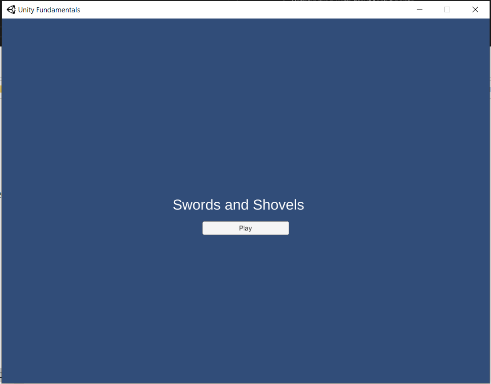
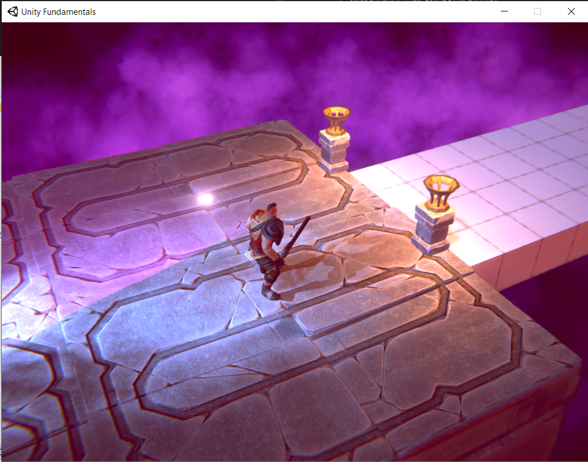

# Unity Fundamentals

My take on the "Swords and Shovels" project on Pluralsight's Unity Fundamentals course by Joshua Kinney.
This project serves as a playground for me to try out different techniques in Unity.
The fundamentals course introduced:

- Prototyping Levels & AI
- Animation Blending
- Pathfinding with NavMeshAgents
- Camera control with Cinemachine

All assets came prepackaged as part of the fundamentals course.

 

# Build Environment

Built with Unity 2019.4.13f1